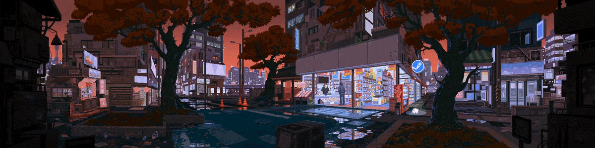

### I'm Francis Bernard - Software Engineer

- 🎓 Currently working on web development technologies JavaScript, React, Node, Tailwind etc.
- 🗺️ I'm always looking to learn new things and help people through technology
- 💫 Future Goals: Never stop learning!
- ⚡ Fun fact: I love playing Sudoku while listening to lo-fi.
- 🧩 There's always a problem to be solved, I'm here for it

---

### 🌐 Socials:
  

---

### 💻 Languages and Tools:

### 📊 GitHub Stats:

 

### 🏆 GitHub Trophies

---

<!-- Proudly created with GPRM ( https://gprm.itsvg.in ) -->
